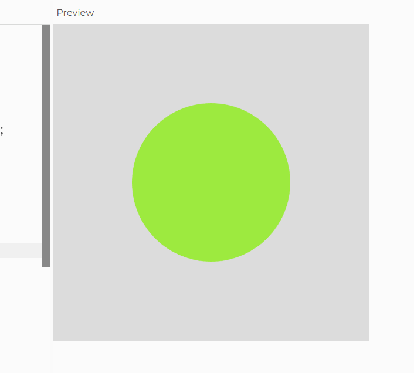
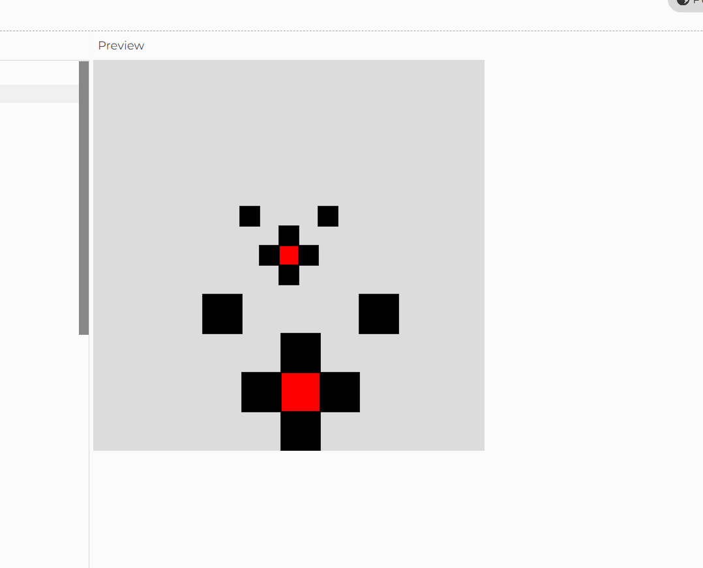

# Week 03 — Arrays, Functions and Transformations

### 🧠 Learning Summary
- Store and delete values in arrays
- Writing and calling custom functions
-transforming shape sizes and positions

### 💻 Final Sketch



### 🎥 Demo Video
[Activity3a on Google Drive](<https://drive.google.com/file/d/1VzPnGUmmqzJTcfKtHC74Thth_69zogYh/view?usp=sharing>)

### 🧩 Key Code Snippet
Activity 3a:
Progressing through indexes in an array
```js
    currentIndex++;
    if (currentIndex >= palette.length)
      currentIndex=0
```

Deleting items from an array
```js
if (key=="3"){
    if (palette.length > 1){
      palette.splice(currentIndex,1)
      currentIndex--
      if (currentIndex=0){
        currentIndex=[palette.length]
```
