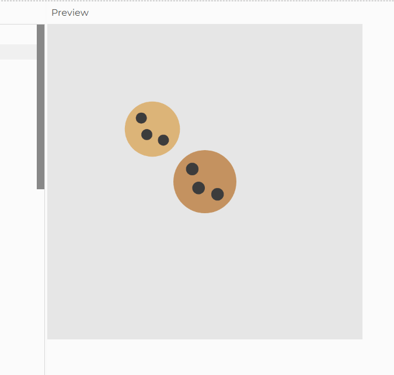
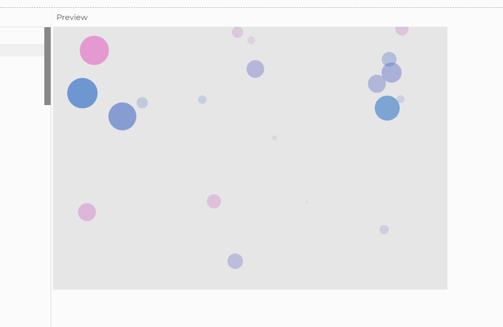

# Week 04 — Object-oriented Programming (Part I)

### 🧠 Learning Summary
- Learned about classes, constructors and methods
- Used for loops to store objects of the same class into an array


### 💻 Final Sketch



### 🎥 Demo Video
[Activity 4a on Google Drive](<https://drive.google.com/file/d/1OghVekbYgAKnYYkhibSUY0oGDr5D3s1V/view?usp=drive_link>)
[Activity 4b on Google Drive](<https://drive.google.com/file/d/1Amxr_TLxNUTRiiON7xJYBr-kAqR3A_N-/view?usp=drive_link>)

### 🧩 Key Code Snippet

- Activity 4a
```js
class Cookie {
  constructor(flavor, sz, x, y) {
    // set up required properties
    this.flavor = flavor;
    this.sz = sz
    this.x = x
    this.y =y
    
```
- Activity 4b
```js
    for (let i = 0; i < NUM_START; i++) {
    let x = random(width);
    let y = random(height);
    let sz = random(12, 60);
    let speedX = random(-2, 2);
    let speedY = random(-2, 0);
    // TODO: pass any extra properties you plan to use
    agents.push(new Agent(x, y, sz, speedX, speedY));
  }
}
```
