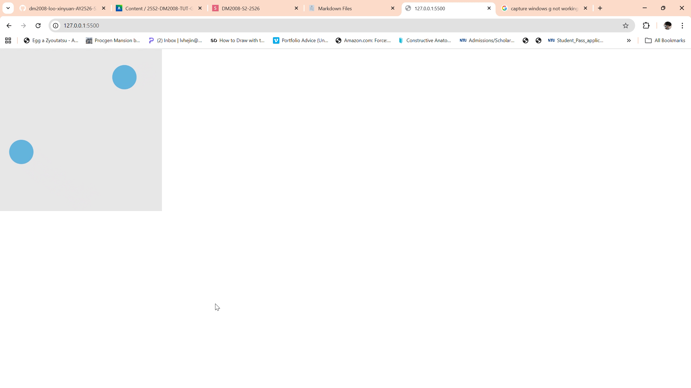

# Week 05 — Object-oriented Programming (Part II)

### 🧠 Learning Summary
- Learned about collision detection (circular and rectangular)
- Store multiple objects of the same class in an array
- Trigger booleans inside classes to indicate collisions

### 💻 Final Sketch


### 🎥 Demo Video
[Watch on Google Drive](<https://drive.google.com/file/d/1LfA734SEhau_YGY4IXoKuya43tY3BT8j/view?usp=sharing>)

### 🧩 Key Code Snippet
```js
for (let i = 0; i < others.length; i++) {
      // Make sure we do not compare the ball to itself
      if (others[i] !== this) {
        let other = others[i];
        let d = dist(this.pos.x, this.pos.y, other.pos.x, other.pos.y);
        if (d < this.r + other.r) {
          push()
          stroke(0,0,0)
          strokeWeight (4)
          fill(255,255,255)
          ellipse(this.pos.x,this.pos.y,this.r*2)
          
          pop()}
```
