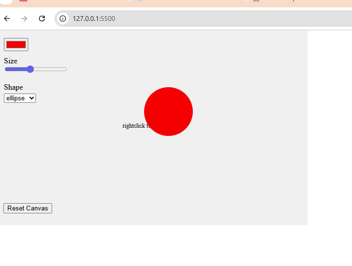

# Week 03 — Interface Design

### 🧠 Learning Summary
- learned to used the built-in UI elements (sliders/buttons/drop-downs/etc.) in p5.js and use divisions to group them
- learned about CSS and how it can keep the functional parts of coding separate from the visual parts separate so it looks neater 
- Made a simple stamping app in which users are able to customise color, shape and size, and wipe canvas

### 💻 Final Sketch


### 🎥 Demo Video
[Watch on Google Drive](<https://drive.google.com/file/d/16x9Bke2AABWlUa8EbIuPrlDqMCndimxL/view?usp=sharing>)

### 🧩 Key Code Snippet
```js
if(colorHistory.length >= 1 && sizeHistory.length >= 1 && shapeHistory.length >= 1 && xHistory.length >= 1 && yHistory.length >= 1) {
  for (let i = 0; i < colorHistory.length; i++) {
  
    push();
      fill(colorHistory[i]);
      let x = xHistory[i];
      let y = yHistory[i];
      let szH = sizeHistory[i];
      let shpH = shapeHistory[i];
      
      
     if (shpH === "ellipse") {
      ellipse(x, y, szH, szH);
     } else if (shpH === "rect") {
      rectMode(CENTER);
      rect(x, y, szH, szH);
    } else if (shpH === "triangle") {
      // Note: for triangle, you'll want to translate to x, y first
      push();
        translate(x, y);
        triangle(-szH * 0.6, szH * 0.5, 0, -szH * 0.6, szH * 0.6, szH * 0.5);
      pop();
    }
    pop();
```

### 🪜 Next Steps
- Add save feature with `saveCanvas()`
