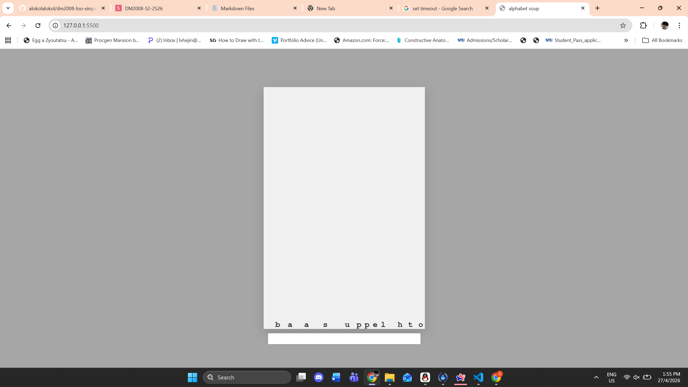
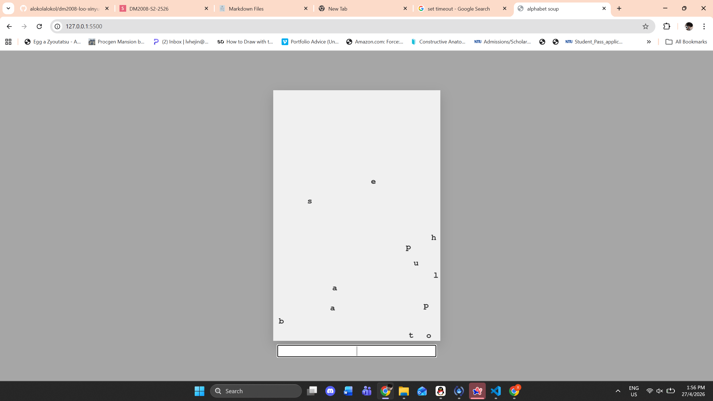
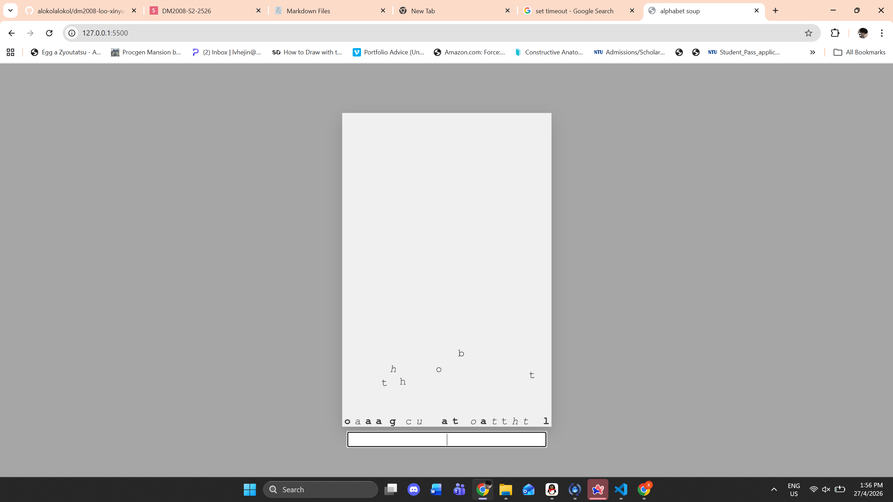
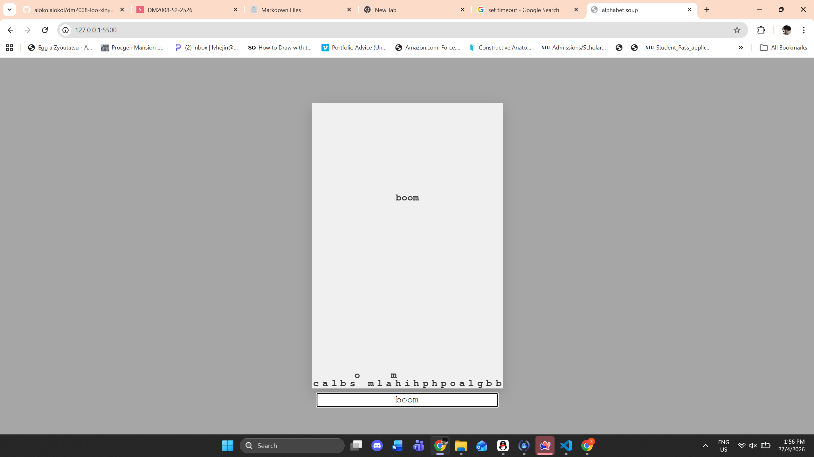

# DM2008 Final - Alphabet Soup
---

Alphabet Soup is a interactive typing experience. Type a sentence, wait three seconds, and letters will fall into the page. You can also use secret commands to make the letters react in different ways.

## How to play
Open the webpage. type something into the input. wait three seconds. voila.

Here is the list of hidden commands:
- float causes letters to float upwards for 3 seconds
- jellybeans causes letters to jump
- boo causes letters to shiver
- boom causes and explosion from the middle of the page
- glitch shuffles letters (that are already present in the soup) and switches between text styles
- skittles randomizes colors for 4 seconds
- clear clears everything in the soup, but slowly

## Final Sketch






## Demo Video
[View here](https://drive.google.com/file/d/1J6_JcBVjSF1rOTzYdQeqvEhpsn8I6knK/view?usp=sharing)

## Key Code
There are three sections to the code: the delayed input, the letter arrays, and the physics system.


1. DELAYED INPUT

This section was assisted with Gemini. On every 3 seconds (idleTimeLimit), idleTimer will run onIdle, which is constantly reset by clearTimeout, that runs every time a key is pressed.

```js

function draw() {
  background(240);
  newText();


  //idle timer`
  if (keyIsPressed) {
    resetIdleTimer()
  }
...
}
// run onIdle once on every 3 seconds`
function resetIdleTimer() {
  clearTimeout(idleTimer);
  idleTimer = setTimeout(onIdle, idleTimeLimit)

}
```

2. LETTER ARRAYS

This section was partially assisted with Gemini. The lettersTemp array splits whatever I have in the input, and pushes it into the letters array (lettersSoup). colliders will spawn for each new letter that is added.
```js

function onIdle() {

 let lettersTemp = split(myInput.value(), '')
 lettersSoup.push(...lettersTemp)    //use spread operator to open lettersTemp array and push into soup 
 if (lettersSoup.length > colliders.length) {
   let diff = lettersSoup.length - colliders.length;
   for (let i = 0; i < diff; i++) {
     //pass specific letters to the constructor (Gemini)
    let char = lettersSoup[colliders.length]
     colliders.push(new Collider(random(width), 50, char))
   }
 }
 ...
  ```

3. PHYSICS

This section was a mixture of the Coding Train videos and Gemini. To summarize, I made a colldier class with functions to apply force, acceleration, velocity and friction. I also did inelastic collision between colliders (copied elastic collision formula from Coding Train then multiplied everything by 0.4)

Possibly the most annoying thing about this entire project was trying to resolve the physics. To this date the colliders still jitter when too many colliders are stacked on top of each other. 
Some things I tried to implement:

- extra friction on top of existing friction function
```js
edges() {
  ...
    //floor
    if (this.pos.y >= height - this.r) {
      //stop sliding on floor
      this.vel.x *= 0.8;
```
- when colliding with floor, kill vertical velocity at a lower gate
```js
edges() {
  ...
     //kill vertical velocity if not bouncing
      if (abs(this.vel.y) < 0.2)
        this.vel.y = 0;
```
- when colliding with other balls, kill all velocity at a lowewr gate
```js
checkCollision(others) {
    for (let i = 0; i < others.length; i++) {
      if (others[i] !== this) {
       ...
          //stop moving if still
          if (this.vel.mag() < 0.2) {
            this.vel.set(0, 0);
          }
```
Killing velocity at a higher velocity gate causes future problems like float commands not working. Also it doesn't feel nice.


